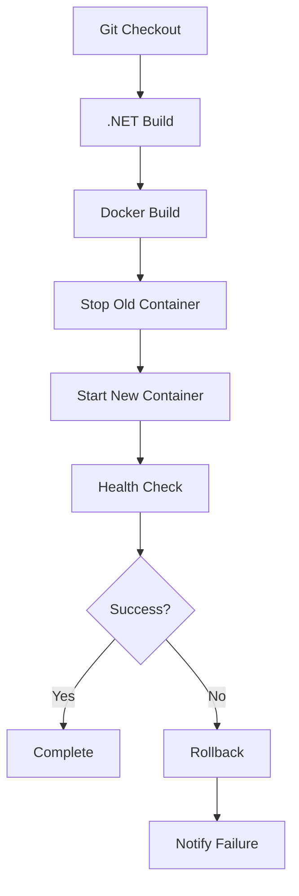

# Jenkins Pipeline - MoneyFix Client

## 📋 Arquivos Jenkins

| Arquivo | Descrição | Uso |
|---------|-----------|-----|
| `Jenkinsfile` | Pipeline completo com .NET install | Servidores sem .NET |
| `Jenkinsfile.simple` | Pipeline simples com docker-compose | Servidores com .NET |
| `jenkins-local.sh` | Script para teste local | Desenvolvimento |

## 🚀 Jenkinsfile (Completo)

### Características:
- ✅ Instala .NET SDK automaticamente
- ✅ Build completo da aplicação
- ✅ Criação de imagem Docker
- ✅ Deploy automático na porta 5133
- ✅ Health check integrado
- ✅ Limpeza automática de imagens antigas

### Variáveis de Ambiente:
```groovy
DOTNET_VERSION = '9.0'
APP_NAME = 'moneyfix-client'
DOCKER_IMAGE = "${APP_NAME}:${BUILD_NUMBER}"
DOCKER_REGISTRY = 'your-registry.com'
```

## 🎯 Jenkinsfile.simple

### Características:
- ✅ Pipeline minimalista
- ✅ Usa docker-compose
- ✅ Build e deploy em um estágio
- ✅ Health check básico
- ✅ Ideal para ambientes com .NET

### Uso:
```bash
# No Jenkins, configure o pipeline para usar:
# Pipeline script from SCM > Git > Jenkinsfile.simple
```

## 🧪 Teste Local

### Script jenkins-local.sh:
```bash
# Executa pipeline completo localmente
./jenkins-local.sh
```

### Stages do script:
1. **Checkout** - Verifica código local
2. **Build .NET** - Restaura, builda e publica
3. **Docker Build** - Cria imagem
4. **Deploy** - Executa container
5. **Health Check** - Verifica aplicação
6. **Cleanup** - Limpa imagens antigas

## 🔧 Configuração do Jenkins

### 1. Novo Job:
```
New Item > Pipeline > MoneyFix-Client
```

### 2. Pipeline Configuration:
```
Pipeline script from SCM
SCM: Git
Repository URL: https://github.com/ronaldocestrela/MoneyFixClient.git
Branch: */developer
Script Path: Jenkinsfile (ou Jenkinsfile.simple)
```

### 3. Triggers (opcional):
```
☑️ GitHub hook trigger for GITScm polling
☑️ Poll SCM: H/5 * * * *
```

## 🐳 Requisitos do Servidor

### Para Jenkinsfile:
- Docker instalado
- Jenkins com Docker plugin
- Acesso à internet (para baixar .NET SDK)

### Para Jenkinsfile.simple:
- Docker e Docker Compose instalados
- .NET 9.0 SDK instalado
- Jenkins com Docker plugin

## 🔍 Troubleshooting

### Build falha no .NET:
```bash
# Verificar versão
dotnet --version

# Instalar manualmente
wget https://dot.net/v1/dotnet-install.sh
chmod +x dotnet-install.sh
./dotnet-install.sh --version 9.0
```

### Docker falha:
```bash
# Verificar Docker
docker --version
docker-compose --version

# Verificar permissões
sudo usermod -aG docker jenkins
sudo systemctl restart jenkins
```

### Health check falha:
```bash
# Verificar logs do container
docker logs moneyfix-client

# Verificar porta
netstat -tulpn | grep 5133
```

### Limpeza manual:
```bash
# Parar todos os containers da aplicação
docker stop moneyfix-client
docker rm moneyfix-client

# Limpar imagens
docker image prune -f
```

## 📊 Monitoramento

### Logs do Jenkins:
```bash
# Logs do build
tail -f /var/log/jenkins/jenkins.log

# Logs do container
docker logs -f moneyfix-client
```

### Health Check Manual:
```bash
# Verificar aplicação
curl -I http://localhost:5133/

# Verificar container
docker ps | grep moneyfix-client
```

## 🔄 Pipeline Flow



## 🎯 Próximos Passos

- [ ] Adicionar notificações (Slack/Email)
- [ ] Implementar blue-green deployment
- [ ] Adicionar testes automatizados
- [ ] Integrar com Docker Registry
- [ ] Configurar ambientes staging/prod separados
